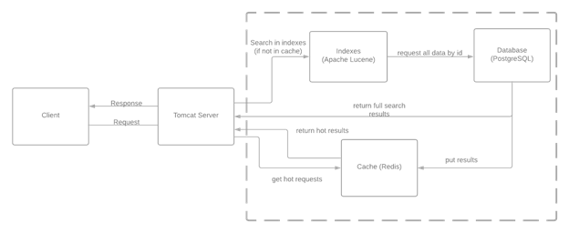

# Поисковик по заданным ресурсам
>«Санкт-Петербургский политехнический университет Петра Великого»  
>Институт компьютерных наук и технологий  
>Высшая школа программной инженерии

>Проект выполнялся в рамках курса "Технологии разработки качественного программного обеспечения"

>Авторы проекта:  
>- Рахматуллин А.Р., группа 3530904/80102  
>- Зыбкин В.Ю., группа 3530904/80102  
>- Гусаров И.Е., группа 3530904/80102

**News Searcher** - это поисковик по заданным ресурсам, который ищет новости по вашему запросу.

Поиск новостей производится из следующих ресурсов:  
- Новости Mail.ru `https://news.mail.ru`
- РИА Новости `https://ria.ru`
- Новости Рамблер `https://news.rambler.ru`

# Установка и запуск проекта
## Client
`Frontend` часть проекта была реализована с помощью `NodeJs v14.17.1` с `npm 6.14.13`. Вам необходимо иметь данные пакеты для успешного прохождения дальнейших инструкций.

1. Для начала необходимо перейти в директорию `news-searcher/client`  
   Установите yarn, с помощью следующей команды, если у вас он не установлен
   > `npm install --global yarn`

2. Далее необходимо скачать все необходимы для проекта пакеты (`Dependencies`)
   > `yarn install`

3. Запускаем проект
   > `yarn start`

Проект запускается по умолчанию на `http://localhost:3000/` и имеет порт `3000`

## Backend
`Backend` часть проекта была реализована на языке Java с использованием фреймфорка `Spring`, таких баз данных, как `Redis` и `PostgreSQL`. Для создания поиска используется библиотека `Apache Lucene`.
Для запуска проекта необходимо выполнить несколько простых действий
1. Перейти в директорию `docker` и выполнить команду
   > `docker-compose up`
2. Собрать проект с помощью команды
   > `gradle clean build`
3. Запустить проект с помощью команды
   > `gradle bootRun`

# Спецификация проекта  
| Идентификатор | Требование |
| --- | --- |
| F_Search_input | Поле для ввода текста, по которому будет производиться поиск. При пустом поле отображаем placeholder с текстом: «Найти в новостях» |
| F_Search_button | Кнопка «поиск» не активна, пока не введен хотя 1 символ в поисковую строку. По нажатию на кнопку производится поисковой запрос по тексту, взятому из поисковой строки. |
| F_Search_clear | Кнопка «Очистки поля» (х). По нажатию данной кнопки стирается текст, набранный в поисковой строке. |
| F_Search_History | Выпадающее меню с историей поиска. Открывается при нажатии на пустую поисковую строку, пропадет при вводе хотя бы 1 символа. История содержит в себе максимум 100 элементов, отсортированных по дате поиска, при этом при нажатии на поисковую строку отображается максимум 10 последних запросов. |
| F_Search_History_Delete | Кнопка удаления элемента из истории поиска, которая имеется у каждого отображаемого элемента истории. По нажатию из списка истории поиска удаляется элемент, соответствующий нажатой кнопке. При этом в отображение истории подставляется наиболее свежий по дате элемент, который ранее не входил в 10 элементов истории поиска до нажатия кнопки удаления. |
| F_Search_result | Блок результата поиска представляет из себя текст, который содержит в себе запрашиваемую строку, а также ссылку на ресурс. По нажатию на текст или ссылку происходит переход на веб сайт. |
| F_Search_Text_Button | Кнопка «текст». Отвечает за переключение с вкладки с результатами изображений при поиске по тексту на вкладку с результатами поиска по тексту. |
| F_Search_Image_Button | Кнопка «картинки». Отвечает за переключение с вкладки с результатами поиска по тексту на вкладку с результатами изображений при поиске по тексту. |
| F_Search_Result_Text | Вкладка с результатами поиска по тексту. Появляется по нажатию кнопки «поиск» и кнопки «текст». Содержит в себе блоки результатов поиска, соответствующих набранной пользователем поисковой строки. Содержит 10 блоков с результатами поиска и максимально 8 похожих запросов. |
| F_Search_Change_Page | Кнопка перехода по страницам результатов поиска. На каждой странице максимум 7 кнопок в зависимости от общего количества полученных результатов. Кнопка с текущим номер странице выделяется кругом. Кнопки отображаются горизонтально, номер на кнопке последовательно увеличивается на единицу слева на право. |
| F_Search_Result_Image | Вкладка с результатами изображений при поиске по тексту. Появляется после нажатия кнопки «картинки». Содержит в себе картинки, полученные с ресурсов, который были найдены по набранному пользователем поисковому запросу. |
| F_Search_People_Ask | Блок с примерами похожих поисковых запросов. Отображается после первого блока с результатами поиска и только на вкладке с результатами поиска по тексту. При нажатии на один из таких запросов текст подставляется в поисковую строку и выполняется запрос. |
| F_Search_Not_Found | Блок с предложениями, как исправить поисковой запрос, отображается при отсутствии результатов поиска по нажатию на кнопку «поиск» |
| F_Search_Incorrect_Request | Блок с текстовым уведомлением о несоблюдении правил корректного запроса с указанием нарушенного пункта правил. Отображается при нажатии кнопки «поиск» и нарушении правил корректности поискового запроса. |
| F_Change_Language | Кнопка «Сменить язык». Располагается справа от кнопки «поиск». Предназначена для смены языка с русского на английский и наоборот. |
| NF_Deploy_Method | Развертывание необходимых компонентов для старта и работы приложения выполнять с помощью docker контейнера. |
| NF_UI | Поддержка адаптивной верстки от мобильных до десктопных устройств. Минимальное поддерживаемая ширина экрана: 320px. Используемый шрифт: Roboto |
| NF_Fronted_Language | Используемые фреймворки на клиентской стороне: React JS, SASS |
| NF_API | В качестве реализации общения между клиентом и сервером использовать Rest API. |
| NF_Backend_Language | Для старта и создания контекста серверного приложения использовать Spring Boot. Для осуществления индексации заданных сайтов использовать Apache Lucene. |
| NF_Request_Limit | Ограничение на количество слов в поисковом запросе: 16 |
| NF_Languages_Limit | Поисковой запрос может содержать английские и русские символы, числа и знаки препинания. |
| NF_Browsers | Поддерживаемые браузеры: · Edge 91-92 · Firefox 59-91 · Chrome 91-93 · Safari 13-14 · Android browser 93 |
| NF_Sources | · Новости Mail.Ru `https://news.mail.ru` · РИА Новости `https://ria.ru` · Новости Рамблер `https://news.rambler.ru` |

# HLD
1. **Архитектура приложения**  
     
   Клиент отправляет запрос на веб сервер. 
   Сервер при запросе истории идет только в кэш. 
   При поиске сначала идет обращение к кэшу, в случае получения данных из кэша результат немедленно возвращается на клиент. 
   Если же в кэше данные не были найдены, то по тексту запроса делаем поиск в индексе. 
   При нахождении записей в индексе, делаем запрос в базу данных и достаем ссылку на ресурс и ссылки на все изображения на ресурсе. 
   Результат обращения к базе данных кладем в кэш и возвращаем клиенту.  
   

2. **Стек технологий**  
   - Backend:
      >1. Spring Boot - для гибкой настройки Java Beans, конфигураций XML и транзакций базы данных.
      >2. Apache Lucene - библиотека для высокопроизводительного полнотекстового поиска. Обеспечивает масштабируемость и достаточно высокоскоростную индексацию. Создаваемый индекс занимает примерно 20—30 % от размера исходного текста.
      >3. Redis - быстрое хранилище данных типа «ключ значение». Redis обеспечивает время отклика на уровне долей миллисекунды и позволяет выполнять миллионы запросов в секунду в режиме реального времени.
      >4. Postgres - свободная объектно-реляционная система управления базами данных (СУБД) для хранения информации, необходимой для разрабатываемого веб-сервиса.
   - Frontend:
      >1. React JS - JavaScript-библиотека для создания пользовательских интерфейсов
      >2. Bootstrap - это открытый и бесплатный HTML, CSS и JS фреймворк, который используется веб-разработчиками для быстрой вёрстки адаптивных дизайнов сайтов и веб-приложений
      >3. SASS - метаязык на основе CSS, предназначенный для увеличения уровня абстракции CSS-кода и упрощения файлов каскадных таблиц стилей.
     

3. **Дизайн Макет**
   Дизайн проекта разрабатывался в `Figma`: `https://www.figma.com/file/Jg3xNaiGoue74I9WlP6UIP/Search-Engine-UI?node-id=12319%3A7370`
   
   
   
   
   
   
   
     
   

4. **Схема базы данных**  
      
   Результат поиска содержит в себе уникальный идентификатор, ссылку на ресурс и ссылки на все картинки конкретного ресурса. 
   Используется для того, чтобы не хранить большое количество данных в индексе.
  
 
5. **API**
    Breakpoints для проекта описаны тут `https://app.swaggerhub.com/apis/gogun/search/1`  
   Поиск по тексту:  
     
   Поиск похожих запросов:  
     
   Поиск изображений:  
     
   

6. **Диаграмма классов**  
     
     
